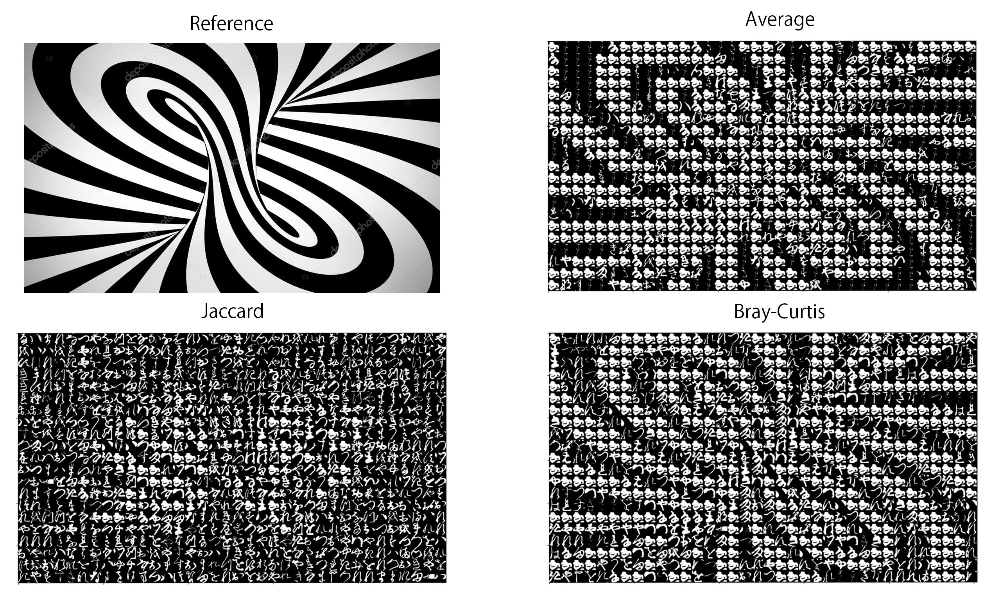
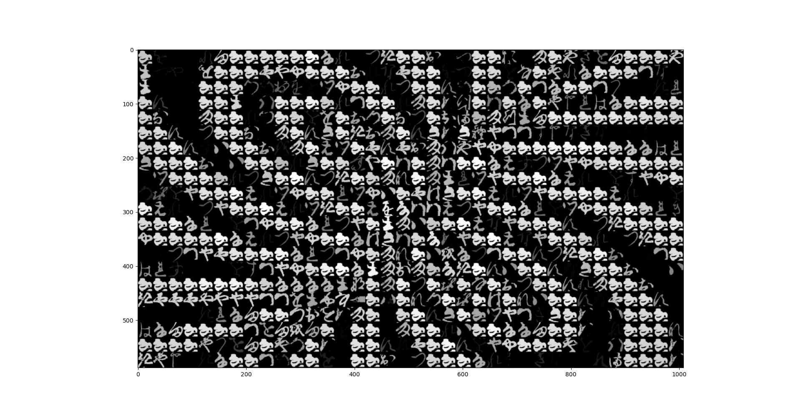
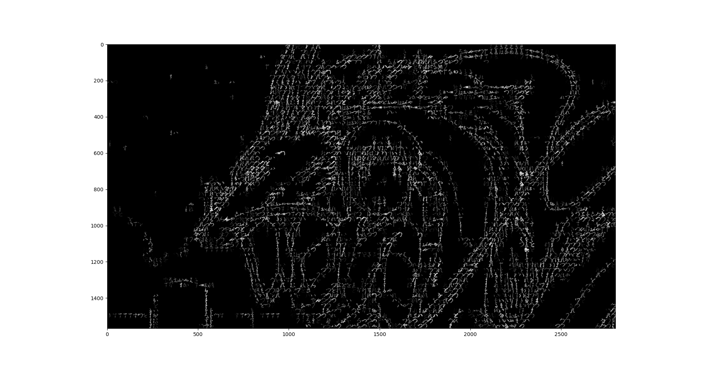
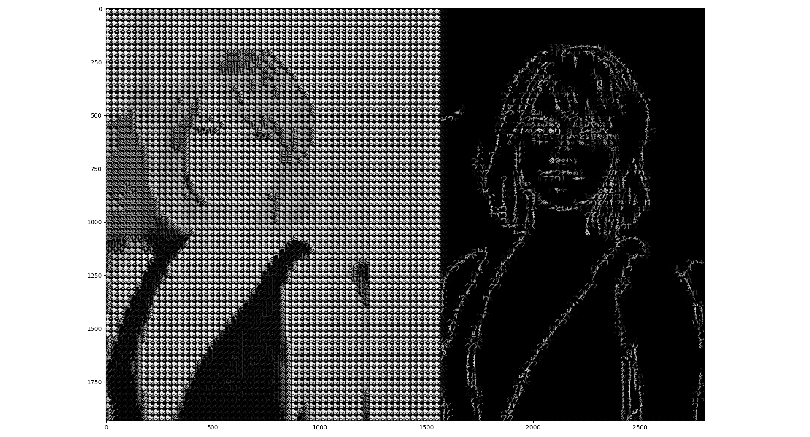

# About 
- [About](#about)
  - [Introduction](#introduction)
  - [Selecting a similarity metric](#selecting-a-similarity-metric)
  - [Comparing the results](#comparing-the-results)
  - [Results using Canny edge detection](#results-using-canny-edge-detection)
- [Description of Equipment & List of Materials](#description-of-equipment--list-of-materials)
- [Installation instructions](#installation-instructions)
- [FAQs](#faqs)
- [How to Contribute](#how-to-contribute)
- [Licensing](#licensing)
- [Instructions for Use](#instructions-for-use)
## Introduction 
Most digital photomosaics are created by comparing average pixel values of images and more efficient versions create maps or dictionaries of photo – average pixel value pairs. With some additional optimizations, this process can create mosaics fast enough to mosaic-ize videos in real-time. However, this photomosaic generator pursues more advanced mosaics with sub-tile accuracy rather than fast generations. The goal of this project is not a particular result, but rather a sense of detail within each tile. This photomosaic generator accomplishes this by calculating the Bray–Curtis dissimilarity between images. Depending on the result desired, it can also use canny edge detection to create more stylized results.

## Selecting a similarity metric
There are many ways to calculate the similarity/dissimilarity between vectors, or more specifically images. For this project, only distance metrics part of the SciPy project were considered. By the advice of my supervisor, first, the Jaccard dissimilarity was considered.

To initially select a metric, first, the results were simply compared visually using pyplot.   
 
 This is was the baseline comparison using the difference of the mean value.
 

Finally, in an attempt to improve the results, the value of each tile can be scaled by the similarity to the target tile. This dramatically reduces noise in dark arrays and helps improve contrast.

## Comparing the results
Using average values worked as expected. It performed well until the swirl lines became too small and close together to be rendered given the tile size.

The Jaccard distance performed unexpectedly bad. This will be addressed later.

The Bray-Curtis performed fairly well, maintaining the swirl even in the center. However, It is quite noisy. This can be partially remedied by scaling the pixel values by the score as shown in the last example.

As a final example, compare the results using averages vs Bray-Curtis (adjusted by score) on a photograph.

There is great potential for improvement over the method using Bray-Curtis dissimilarity, however, it does seem to be a clear improvement over using the average in terms of detail. Notice the wood grain, and the face of the women in the background.

## Results using Canny edge detection

 

# Description of Equipment & List of Materials
This project was created in Python 3.6 and currently requires "kmnist-train-imgs.npz" from https://github.com/rois-codh/kmnist 

It is also dependant on Numpy, SciPy, PIL, and matplotlib libraries. It is recommended to use Anaconda to install the libraries. 

"KMNIST Dataset" (created by CODH), adapted from "Kuzushiji Dataset" (created by NIJL and others), doi:10.20676/00000341
# Installation instructions
Use git clone https://github.com/digitalpanda213/mosaic
or download the zip from GitHub

As this project only exists in a Python script, a working Python installation is required. See https://www.python.org/ for more details about installing Python. 
# FAQs
* **How do I get a better result?**  
Some images look much better using Canny, some do not. As this is a matter of taste, adjust the tile size, number of characters to use, and whether or not to use Canny. The resolution of the image to be mosaic-ized also has an effect if using Canny.

# How to Contribute
If you feel the desire to contribute, please use Git and open a pull request.  
Otherwise, I can be reached at coatesal@appstate.edu.
# Licensing
All the contents of the repository are licensed under the CC BY-SA 4.0 license.
# Instructions for Use
To run the script, use create_mosaic(Image, Dataset, NumTiles, use_canny=Boolean) where:
 - Image is the image to be turned into a mosaic.
 - Dataset is either “kkanji2-1.npz” or “kmnist-train-imgs.npz.” 
 - NumTiles is the numbers tile width-wise.
 - use_canny chooses to use canny.(defaults to false).

To save the image use Pyplot's built-in save function.